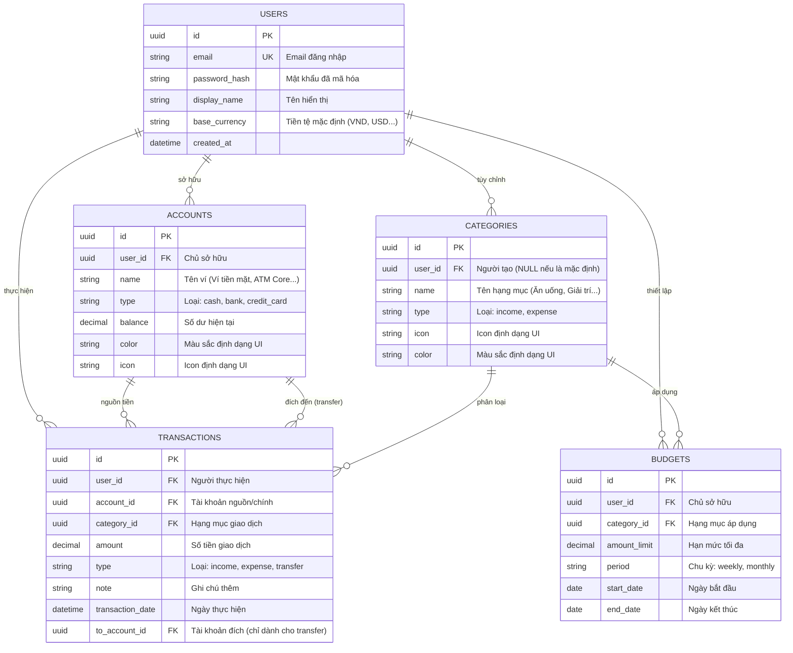

# Tài liệu Đặc tả Cơ sở dữ liệu: FinTrack App

Tài liệu này mô tả chi tiết cấu trúc cơ sở dữ liệu, các thuộc tính và mối quan hệ giữa các thực thể trong ứng dụng Quản lý tài chính cá nhân FinTrack.

---

## 1. Sơ đồ thực thể quan hệ (ERD)

---

## 2. Đặc tả các mối quan hệ (Bidirectional)

### 2.1. USERS ↔ ACCOUNTS (1:N)
*   **Chiều xuôi (1-N)**: Một **User** có thể sở hữu nhiều **Account** khác nhau để quản lý các dòng tiền (Ví, Ngân hàng, Thẻ).
*   **Chiều ngược (N-1)**: Một **Account** nhất định chỉ thuộc về quyền sở hữu của duy nhất một **User**.

### 2.2. USERS ↔ CATEGORIES (1:N)
*   **Chiều xuôi (1-N)**: Một **User** có thể tạo ra nhiều **Category** tùy chỉnh theo nhu cầu cá nhân.
*   **Chiều ngược (N-1)**: Mỗi **Category** tùy chỉnh chỉ được thấy và sử dụng bởi **User** đã tạo ra nó. 
    > [!NOTE]
    > Các Category có `user_id = NULL` được coi là hệ thống (System Defaults) mà tất cả User đều thấy.

### 2.3. USERS ↔ TRANSACTIONS (1:N)
*   **Chiều xuôi (1-N)**: Một **User** phát sinh nhiều **Transaction** trong quá trình sử dụng.
*   **Chiều ngược (N-1)**: Một bản ghi **Transaction** luôn được định danh cho một **User** thực hiện duy nhất.

### 2.4. ACCOUNTS ↔ TRANSACTIONS (1:N)
*   **Chiều xuôi (1-N)**: Một **Account** có thể là nguồn tiền cho nhiều **Transaction**.
*   **Chiều ngược (N-1)**: Mỗi **Transaction** (ngoại trừ Transfer) phải gắn với một **Account** nguồn duy nhất để trừ/cộng tiền.
*   **Trường hợp đặc biệt (Transfer)**: Một **Transaction** loại `transfer` sẽ liên kết với **hai** Account: một làm nguồn (`account_id`) và một làm đích (`to_account_id`).

### 2.5. CATEGORIES ↔ TRANSACTIONS (1:N)
*   **Chiều xuôi (1-N)**: Một **Category** có thể được gắn cho nhiều **Transaction** khác nhau.
*   **Chiều ngược (N-1)**: Mỗi **Transaction** nên thuộc về một **Category** để phục vụ việc thống kê và báo cáo.

### 2.6. CATEGORIES ↔ BUDGETS (1:N)
*   **Chiều xuôi (1-N)**: Một **Category** có thể được thiết lập hạn mức chi tiêu cho nhiều chu kỳ **Budget** khác nhau.
*   **Chiều ngược (N-1)**: Mỗi bản ghi **Budget** tập trung kiểm soát chi tiêu cho duy nhất một **Category** mục tiêu.

### 2.7. USERS ↔ BUDGETS (1:N)
*   **Chiều xuôi (1-N)**: Một **User** có quyền tạo nhiều kế hoạch **Budget** (cho các Category khác nhau).
*   **Chiều ngược (N-1)**: Một bản ghi **Budget** thuộc quyền quản lý của một **User**.

---

## 3. Các ràng buộc logic quan trọng

1.  **Tính nguyên tử khi Chuyển tiền (Atomicity)**: Khi thực hiện `type = transfer`, Logic Backend phải đảm bảo trừ tiền `account_id` và cộng tiền `to_account_id` trong cùng một Database Transaction.
2.  **Ràng buộc Xóa (Deletion Constraints)**:
    *   `USERS` bị xóa -> CASCADE xóa toàn bộ `ACCOUNTS`, `TRANSACTIONS`, `BUDGETS`.
    *   `ACCOUNTS` bị xóa -> RESTRICT (không cho xóa nếu còn Transaction) hoặc SET NULL/ARCHIVE (ẩn đi nhưng giữ dữ liệu lịch sử).
    *   `CATEGORIES` bị xóa -> SET DEFAULT/SET NULL cho các Transaction liên quan để tránh mất lịch sử thu chi.
3.  **Toàn vẹn số dư (Balance Integrity)**: `current_balance` trong bảng `ACCOUNTS` phải luôn bằng: `initial_balance` + Σ(Incomes) - Σ(Expenses) - Σ(Transfers Out) + Σ(Transfers In).
